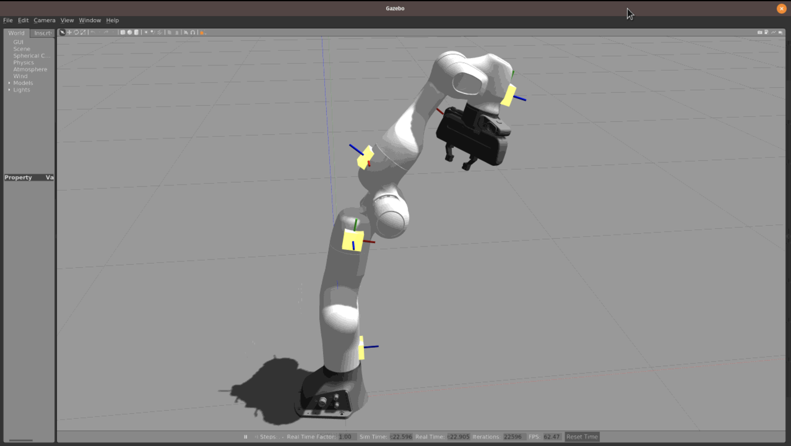
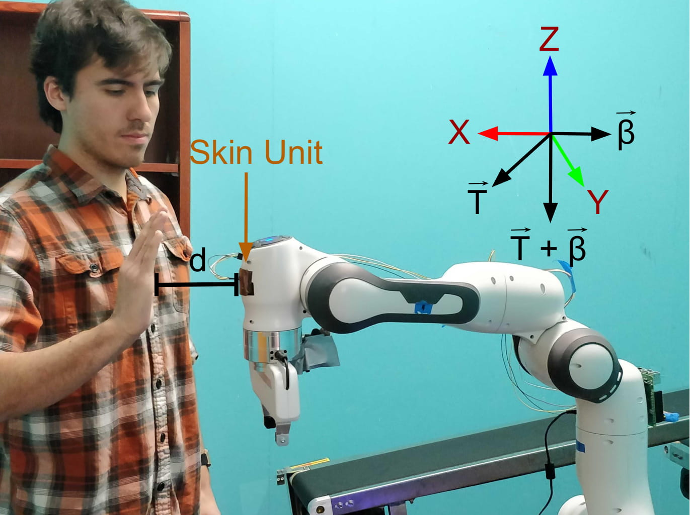
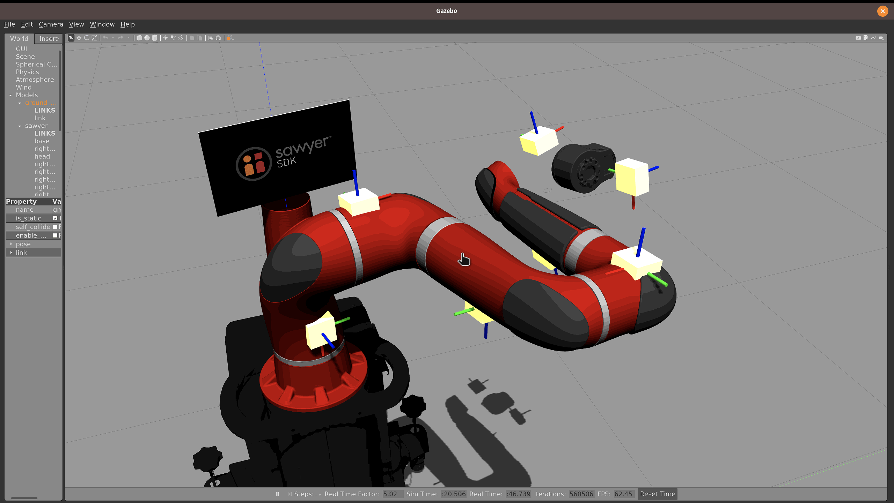

# General
- **Current Release**: `0.0.1` as of 2020/3/25
- **Suporting Version**: `ROS Melodic`
- **Documentation**: https://hiro-group.ronc.one/ros_robotic_skin/

# Installation

We have an `install.sh` script that will install the following packages:

- Installs our Python `robotic_skin` package [here](https://github.com/HIRO-group/robotic_skin)

- The Franka Panda Gazebo Simulator package [here](https://github.com/HIRO-group/panda_simulation)

- The Sawyer Gazebo simulator

## To run `install.sh`
Make sure that you have cloned this repository from the `src` folder of a catkin workspace (eg: from `catkin_ws/src`). If you haven't, the script will give an error.
Additionally, you should clone this repository in an **empty** catkin workspace. For example, if you have the `franka_ros` package in the workspace, it will be deleted in favor of our forked version that works with this package.

### Usage:
```sh
./install.sh --git-option https|ssh --franka-build apt|source
```

### Examples
1. Simply Run (Default options= `ssh` && `apt`)
```sh
./install.sh
```

2. Use options
```sh
./install.sh --git-option ssh --franka-build source
```
This command will build `libfranka` from source and use ssh for git.

### Options
- `--git-option` <br>
specifies if we clone the `HIRO` repos via https or ssh.

- `franka_build` <br>
specifies whether we want to build `libfranka` from source or install it via `apt`.

### Docker
We also have a [`Dockerfile`](https://github.com/HIRO-group/ros_robotic_skin/blob/master/Dockerfile). See how you install and run it in [our Wiki page](https://github.com/HIRO-group/ros_robotic_skin/wiki/Running-on-Docker)

# Launch Files
## Prerequisite
In order to run the Panda Gazebo simulation, make sure that you have built your workspace, then run (from `catkin_ws`, or the root of your catkin workspace)

This tutorial will **assume** that you have added this line to your `~/.bashrc` so you don't have to `source` the `setup.bash` file everytime you open
a terminal.

```sh
source <path to your workspace>/devel/setup.bash
```

## Running Panda in simulation
You can add as many IMUs as you want in `config/imu_poses.txt`.
The format per line is as follows:

```sh
x,y,z,roll,pitch,yaw, num_link_connected_to
```

Run

```sh
python scripts/imu_spawners/spawn_real_imus.py
```

to update the xacro file with the IMU changes. Now, to run the simulation:

```sh

roslaunch ros_robotic_skin simulation.launch
```




## Running Real Panda
Change the `robot_ip` accordingly.
```sh
roslaunch ros_robotic_skin panda.launch robot_ip:=172.16.0.172
```



## Running Sawyer in simulation
```sh
roslaunch ros_robotic_skin sawyer_world.launch
```



# For DEVELOPERS
## Test
We use 2 different tests.
1. `Flake8` <br>
to enforce style consistency across Python projects.
2. `ROS Test` <br>
to ensure our codes run without any bugs

### RUN TESTS BEFORE COMMITTING
#### `Flake8`
```sh
flake8 . --max-complexity=10 --max-line-length=140
```
within this repository (after cloning and changing directories to `ros_robotic_skin`).

#### `ROS Test`
```sh
cd ~/catkin_ws
catkin run_tests
```

Guides to add tests are descibed in [our Wiki page](https://github.com/HIRO-group/ros_robotic_skin/wiki/How-to-add-test)


## Parameters
Parameters are all saved in `config/params.yaml`. <br>
In every launch file, it should load the yaml file. <br>
Whenever you use it, load it like `example_param = ropsy.get_param("/example_param")`

Refer to
- https://roboticsbackend.com/ros-param-yaml-format/
- https://roboticsbackend.com/get-set-ros-params-rospy-roscpp/
